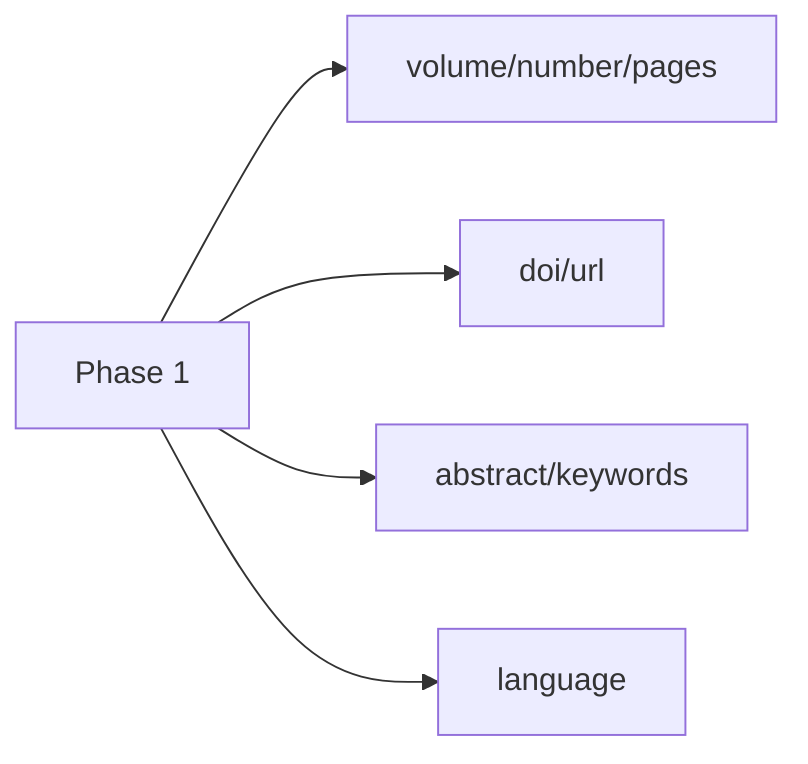
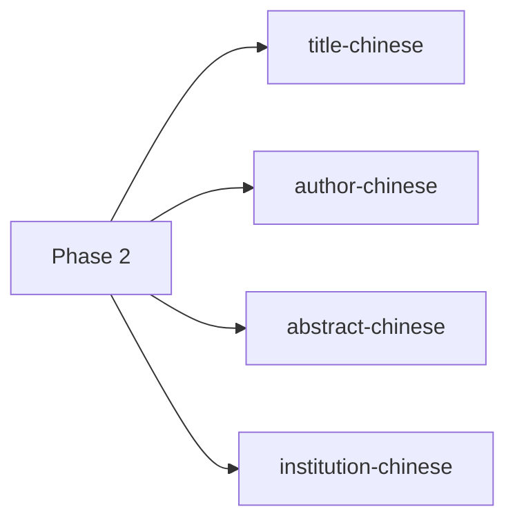
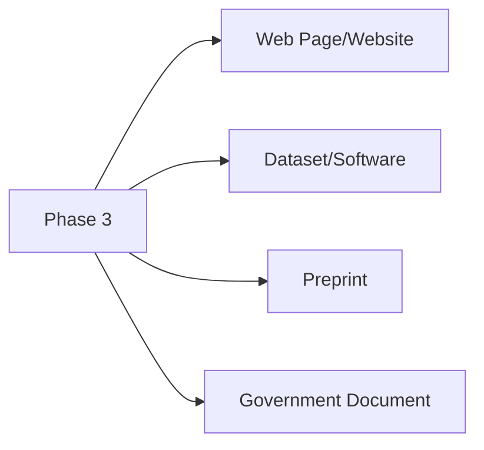

# OVEREND vs EndNote/Zotero 書目欄位比較

> 本文件詳細比較 OVEREND 與主流文獻管理軟體（EndNote、Zotero）在書目類型和欄位支援上的差異，作為功能開發的參考依據。

---

## 一、核心數據總覽

### 1.1 書目類型數量對照

| 軟體 | 書目類型數量 | 覆蓋率 |
|------|--------------|--------|
| **EndNote** | 52 種 | 100% (基準) |
| **Zotero** | 36 種 | 69% |
| **OVEREND** | 14 種 | 27% |

### 1.2 核心指標對照

| 指標 | EndNote | Zotero | OVEREND |
|------|---------|--------|---------|
| 書目類型數量 | 52 | 36 | 14 |
| 核心欄位數量 | 40-50 | 40+ | ~15 |
| 中文支援評價 | ⭐ 差 | ⭐⭐ 普通 | 🎯 目標：優 |
| 必填欄位驗證 | 全面 | 中等 | 僅 3 種類型 |
| 常用欄位完整度 | 95%+ | 90%+ | 30-40% |

---

## 二、OVEREND 支援的書目類型

### 2.1 目前支援的 14 種書目類型

| # | 類型代碼 | 中文名稱 | 說明 |
|---|----------|----------|------|
| 1 | `article` | 期刊論文 | 學術期刊中的文章 |
| 2 | `book` | 書籍 | 完整的書籍著作 |
| 3 | `booklet` | 小冊子 | 無出版社的印刷品 |
| 4 | `inbook` | 書籍章節 | 書籍中的特定章節 |
| 5 | `incollection` | 文集篇章 | 編輯文集中的一篇 |
| 6 | `inproceedings` | 會議論文 | 會議論文集中的論文 |
| 7 | `conference` | 會議 | 等同於 inproceedings |
| 8 | `manual` | 技術手冊 | 技術文件與操作手冊 |
| 9 | `mastersthesis` | 碩士論文 | 碩士學位論文 |
| 10 | `phdthesis` | 博士論文 | 博士學位論文 |
| 11 | `proceedings` | 會議論文集 | 完整的會議論文集 |
| 12 | `techreport` | 技術報告 | 機構技術報告 |
| 13 | `unpublished` | 未發表 | 未正式發表的作品 |
| 14 | `misc` | 其他 | 其他無法分類的類型 |

### 2.2 台灣學術常用類型覆蓋狀況

| 常用類型 | 支援狀況 | 備註 |
|----------|----------|------|
| 期刊論文 (article) | ✅ 支援 | 最常用 |
| 書籍 (book) | ✅ 支援 | 常用 |
| 碩士論文 (mastersthesis) | ✅ 支援 | 台灣學術必需 |
| 博士論文 (phdthesis) | ✅ 支援 | 台灣學術必需 |
| 會議論文 (inproceedings) | ✅ 支援 | 常用 |
| 書籍章節 (inbook) | ✅ 支援 | 常用 |

> [!TIP]
> **台灣學術論文常用類型覆蓋率達 80%**，涵蓋 article、book、mastersthesis、phdthesis 等核心類型。

---

## 三、OVEREND 缺少的書目類型（39 種）

### 3.1 期刊/新聞類（6 種）

| # | 類型名稱 | 說明 | 優先級 |
|---|----------|------|--------|
| 1 | Journal Article (電子版) | 電子期刊文章 | 🔴 高 |
| 2 | Newspaper Article | 新聞報導 | 🟡 中 |
| 3 | Magazine Article | 雜誌文章 | 🟡 中 |
| 4 | Blog | 部落格文章 | 🟢 低 |
| 5 | Editorial | 社論 | 🟢 低 |
| 6 | Review | 評論文章 | 🟡 中 |

### 3.2 網路資源類（4 種）

| # | 類型名稱 | 說明 | 優先級 |
|---|----------|------|--------|
| 7 | Web Page | 網頁 | 🔴 高 |
| 8 | Website | 網站 | 🔴 高 |
| 9 | Social Media Post | 社群媒體貼文 | 🟢 低 |
| 10 | Online Forum Post | 線上論壇發文 | 🟢 低 |

### 3.3 法律文件類（4 種）

| # | 類型名稱 | 說明 | 優先級 |
|---|----------|------|--------|
| 11 | Patent | 專利 | 🟡 中 |
| 12 | Statute | 法規 | 🟡 中 |
| 13 | Case | 判例 | 🟡 中 |
| 14 | Legal Rule | 法律規則 | 🟡 中 |

### 3.4 政府/機構類（3 種）

| # | 類型名稱 | 說明 | 優先級 |
|---|----------|------|--------|
| 15 | Government Document | 政府文件 | 🔴 高 |
| 16 | Report | 報告 | 🔴 高 |
| 17 | Working Paper | 工作論文 | 🟡 中 |

### 3.5 多媒體類（6 種）

| # | 類型名稱 | 說明 | 優先級 |
|---|----------|------|--------|
| 18 | Podcast | Podcast 節目 | 🟢 低 |
| 19 | Film | 電影 | 🟡 中 |
| 20 | Broadcast | 廣播節目 | 🟢 低 |
| 21 | Video Recording | 影片錄影 | 🟡 中 |
| 22 | Audio Recording | 音訊錄音 | 🟢 低 |
| 23 | Artwork | 藝術作品 | 🟢 低 |

### 3.6 學術資源類（6 種）

| # | 類型名稱 | 說明 | 優先級 |
|---|----------|------|--------|
| 24 | Dataset | 資料集 | 🔴 高 |
| 25 | Software | 軟體 | 🔴 高 |
| 26 | Presentation | 簡報 | 🟡 中 |
| 27 | Conference Paper | 會議論文（有別於 inproceedings） | 🟡 中 |
| 28 | Preprint | 預印本 | 🔴 高 |
| 29 | Thesis | 論文（未區分碩博士） | 🟢 低 |

### 3.7 其他類型（10 種）

| # | 類型名稱 | 說明 | 優先級 |
|---|----------|------|--------|
| 30 | Interview | 訪談 | 🟢 低 |
| 31 | Personal Communication | 個人通訊 | 🟢 低 |
| 32 | Letter | 書信 | 🟢 低 |
| 33 | Manuscript | 手稿 | 🟡 中 |
| 34 | Map | 地圖 | 🟢 低 |
| 35 | Chart/Table | 圖表 | 🟢 低 |
| 36 | Encyclopedia Article | 百科全書條目 | 🟡 中 |
| 37 | Dictionary Entry | 字典條目 | 🟢 低 |
| 38 | Catalog | 目錄 | 🟢 低 |
| 39 | Standard | 標準規範 | 🟡 中 |

---

## 四、必填欄位驗證

### 4.1 OVEREND 目前有驗證的類型（僅 3 種）

#### Article（期刊論文）

| 欄位 | 中文名稱 | 必填 |
|------|----------|------|
| `author` | 作者 | ✅ |
| `title` | 標題 | ✅ |
| `journal` | 期刊名稱 | ✅ |
| `year` | 年份 | ✅ |

#### Book（書籍）

| 欄位 | 中文名稱 | 必填 |
|------|----------|------|
| `author` | 作者 | ✅ |
| `title` | 書名 | ✅ |
| `publisher` | 出版社 | ✅ |
| `year` | 年份 | ✅ |

#### Inproceedings（會議論文）

| 欄位 | 中文名稱 | 必填 |
|------|----------|------|
| `author` | 作者 | ✅ |
| `title` | 標題 | ✅ |
| `booktitle` | 會議名稱 | ✅ |
| `year` | 年份 | ✅ |

> [!WARNING]
> **其餘 11 種書目類型尚未實作必填欄位驗證！**

---

## 五、OVEREND 缺少的重要欄位

### 5.1 必要資訊欄位（10 個）

| # | 欄位代碼 | 中文名稱 | 說明 | 急迫性 |
|---|----------|----------|------|--------|
| 1 | `abstract` | 摘要 | 文章摘要 | 🔴 高 |
| 2 | `keywords` | 關鍵字 | 關鍵詞列表 | 🔴 高 |
| 3 | `doi` | 數位物件識別碼 | DOI 連結 | 🔴 高 |
| 4 | `issn` | 期刊國際標準號 | ISSN 碼 | 🟡 中 |
| 5 | `language` | 語言 | 文獻語言 | 🔴 高 |
| 6 | `url` | 網址 | 線上連結 | 🔴 高 |
| 7 | `accessed` | 存取日期 | 最後存取日期 | 🟡 中 |
| 8 | `volume` | 卷 | 期刊卷號 | 🔴 高 |
| 9 | `number/issue` | 期 | 期刊期號 | 🔴 高 |
| 10 | `pages` | 頁碼 | 起迄頁碼 | 🔴 高 |

### 5.2 貢獻者欄位（3 個）

| # | 欄位代碼 | 中文名稱 | 說明 | 急迫性 |
|---|----------|----------|------|--------|
| 11 | `editor` | 編輯 | 編者資訊 | 🟡 中 |
| 12 | `translator` | 譯者 | 翻譯者資訊 | 🟡 中 |
| 13 | `reviewer` | 審查者 | 審稿人資訊 | 🟢 低 |

### 5.3 出版資訊欄位（4 個）

| # | 欄位代碼 | 中文名稱 | 說明 | 急迫性 |
|---|----------|----------|------|--------|
| 14 | `publisher` | 出版社 | article 也需要 | 🟡 中 |
| 15 | `place` | 出版地 | 出版地點 | 🟡 中 |
| 16 | `edition` | 版次 | 版本資訊 | 🟡 中 |
| 17 | `series` | 叢書名 | 叢書系列 | 🟢 低 |

### 5.4 識別碼欄位（3 個）

| # | 欄位代碼 | 中文名稱 | 說明 | 急迫性 |
|---|----------|----------|------|--------|
| 18 | `isbn` | 國際標準書號 | ISBN 碼 | 🟡 中 |
| 19 | `pmid` | PubMed ID | 生醫資料庫 ID | 🟢 低 |
| 20 | `arxiv` | arXiv ID | 預印本 ID | 🟢 低 |

---

## 六、台灣學術特有需求欄位

### 6.1 A 級：立即需要（14 個）

> [!IMPORTANT]
> 這些欄位是台灣學術論文撰寫的核心需求，應優先開發。

#### 中文支援欄位

| # | 欄位代碼 | 中文名稱 | 說明 |
|---|----------|----------|------|
| 1 | `title-chinese` | 中文標題 | 雙語論文必須 |
| 2 | `author-chinese` | 中文作者 | 中文姓名格式 |
| 3 | `institution-chinese` | 中文機構 | 中文單位名稱 |
| 4 | `abstract-chinese` | 中文摘要 | 雙語摘要支援 |

#### 基本資訊欄位

| # | 欄位代碼 | 中文名稱 | 說明 |
|---|----------|----------|------|
| 5 | `abstract` | 英文摘要 | 摘要內容 |
| 6 | `keywords` | 關鍵字 | 關鍵詞列表 |
| 7 | `doi` | DOI | 數位物件識別碼 |
| 8 | `url` | 網址 | 線上連結 |
| 9 | `accessed` | 存取日期 | 網路資源必須 |

#### 期刊資訊欄位

| # | 欄位代碼 | 中文名稱 | 說明 |
|---|----------|----------|------|
| 10 | `issn` | ISSN | 期刊識別碼 |
| 11 | `volume` | 卷 | 期刊卷號 |
| 12 | `number` | 期 | 期刊期號 |
| 13 | `pages` | 頁碼 | 起迄頁碼 |
| 14 | `language` | 語言 | 文獻語言 |

### 6.2 B 級：重要但不緊急（10 個）

#### 出版資訊欄位

| # | 欄位代碼 | 中文名稱 | 說明 |
|---|----------|----------|------|
| 1 | `isbn` | ISBN | 書籍識別碼 |
| 2 | `edition` | 版次 | 版本資訊 |
| 3 | `series` | 叢書名 | 叢書系列 |
| 4 | `place` | 出版地 | 出版地點 |

#### 貢獻者欄位

| # | 欄位代碼 | 中文名稱 | 說明 |
|---|----------|----------|------|
| 5 | `editor` | 編者 | 編輯資訊 |
| 6 | `translator` | 譯者 | 翻譯者資訊 |

#### 台灣特有欄位（碩博士論文）

| # | 欄位代碼 | 中文名稱 | 說明 |
|---|----------|----------|------|
| 7 | `advisor` | 指導教授 | 論文指導者 |
| 8 | `degree` | 學位類型 | 碩士/博士 |
| 9 | `department` | 系所 | 系所名稱 |
| 10 | `university-location` | 大學所在地 | 大學所在城市 |

### 6.3 C 級：進階功能（6 個）

#### 法規判例欄位

| # | 欄位代碼 | 中文名稱 | 說明 |
|---|----------|----------|------|
| 1 | `court` | 法院 | 審理法院 |
| 2 | `case-number` | 案號 | 案件編號 |
| 3 | `judgment-date` | 判決日期 | 判決宣判日期 |

#### 政府文件欄位

| # | 欄位代碼 | 中文名稱 | 說明 |
|---|----------|----------|------|
| 4 | `document-number` | 文號 | 公文文號 |
| 5 | `issuing-agency` | 發文機關 | 發文單位 |
| 6 | `regulation-number` | 法規編號 | 法規條號 |

---

## 七、功能差距分析

### 7.1 整體完整度

```
┌────────────────────────────────────────────────────────────────┐
│                      功能完整度對照                              │
├─────────────────────┬──────────┬──────────┬──────────┐
│        指標          │  EndNote │  Zotero  │ OVEREND  │
├─────────────────────┼──────────┼──────────┼──────────┤
│ 書目類型數量          │    52    │    36    │    14    │
│ 書目類型覆蓋率        │   100%   │    69%   │    27%   │
│ 核心欄位數量          │   40-50  │    40+   │   ~15    │
│ 常用欄位完整度        │   95%+   │   90%+   │  30-40%  │
│ 台灣學術類型覆蓋      │    80%   │    75%   │    80%   │
│ 中文欄位支援          │    差    │    普通   │ 0% (待開發) │
└─────────────────────┴──────────┴──────────┴──────────┘
```

### 7.2 差距摘要

| 差距項目 | 數量/狀態 |
|----------|-----------|
| 缺少書目類型 | **39 種** |
| 缺少核心欄位 | **約 25-35 個** |
| 缺少中文欄位 | **4 個** |
| 未驗證的書目類型 | **11 種** |

---

## 八、開發優先順序建議

### 8.1 Phase 1：核心欄位補齊（立即）



**目標**：補齊 A 級欄位，讓 article 類型達到實用標準。

### 8.2 Phase 2：中文支援（2-4 週內）



**目標**：實現 OVEREND 的中文差異化優勢。

### 8.3 Phase 3：書目類型擴充（1-2 月內）



**目標**：新增高優先級書目類型，覆蓋率提升至 50%+。

### 8.4 Phase 4：進階功能（長期）

- 法律文件類型支援
- 多媒體類型支援
- 其他專業類型

---

## 九、附錄：完整欄位對照表

### A. EndNote 常用欄位 vs OVEREND

| EndNote 欄位 | OVEREND 對應 | 支援狀態 |
|--------------|--------------|----------|
| Author | author | ✅ |
| Title | title | ✅ |
| Year | year | ✅ |
| Journal | journal | ✅ |
| Publisher | publisher | ✅ |
| Volume | - | ❌ 待開發 |
| Issue | - | ❌ 待開發 |
| Pages | - | ❌ 待開發 |
| DOI | - | ❌ 待開發 |
| URL | - | ❌ 待開發 |
| Abstract | - | ❌ 待開發 |
| Keywords | - | ❌ 待開發 |
| Editor | - | ❌ 待開發 |
| Edition | - | ❌ 待開發 |
| ISBN | - | ❌ 待開發 |
| ISSN | - | ❌ 待開發 |
| Language | - | ❌ 待開發 |
| Accessed Date | - | ❌ 待開發 |

### B. 必填欄位完整性

| 書目類型 | 必填欄位數 | 驗證狀態 |
|----------|------------|----------|
| article | 4 | ✅ 已驗證 |
| book | 4 | ✅ 已驗證 |
| inproceedings | 4 | ✅ 已驗證 |
| booklet | - | ❌ 未驗證 |
| inbook | - | ❌ 未驗證 |
| incollection | - | ❌ 未驗證 |
| conference | - | ❌ 未驗證 |
| manual | - | ❌ 未驗證 |
| mastersthesis | - | ❌ 未驗證 |
| phdthesis | - | ❌ 未驗證 |
| proceedings | - | ❌ 未驗證 |
| techreport | - | ❌ 未驗證 |
| unpublished | - | ❌ 未驗證 |
| misc | - | ❌ 未驗證 |

---

> **文件版本**：v1.0  
> **建立日期**：2026-01-09  
> **最後更新**：2026-01-09
