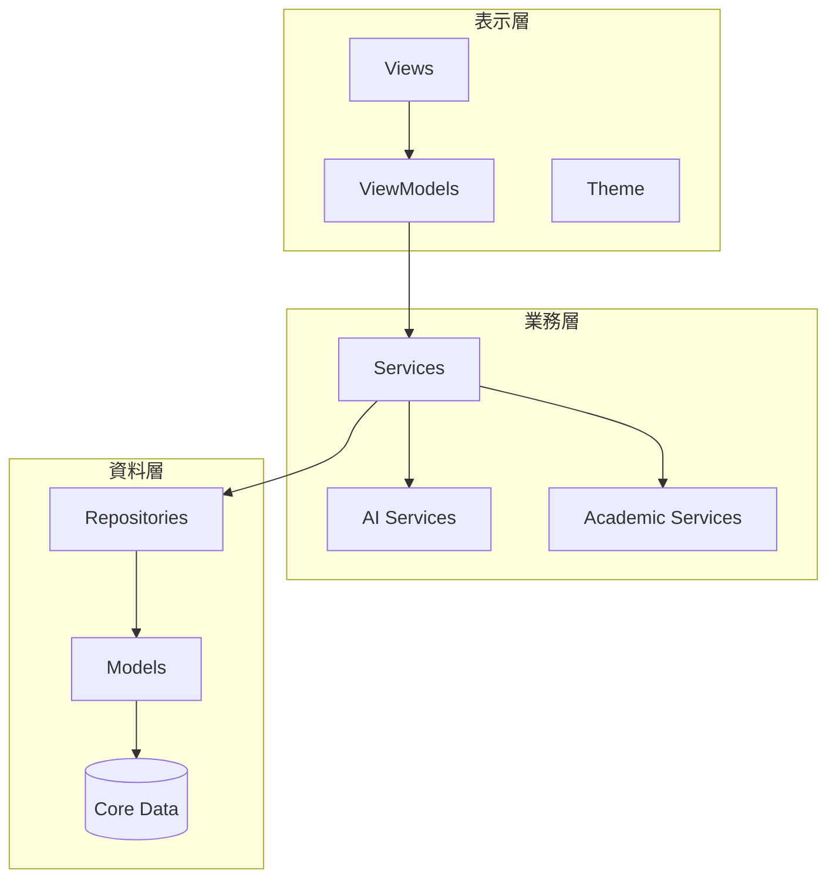

    <h1>OVEREND</h1>
    
Flagship Developer Manual

    
讓研究者專注於研究本質，而非工具操作。整合全專案技術精華，打造極致的學術寫作體驗。

    

        Version 2.0 | <b>2026 旗艦版</b>
    

## 📖 目錄

1. [專案概述與願景](#1-專案概述與願景)
2. [使用者快速入門](#2-使用者快速入門)
3. [技術架構與專案結構](#3-技術架構與專案結構)
4. [AI 智慧功能詳解](#4-ai-智慧功能詳解)
5. [UI/UX 設計與翡翠語言](#5-uiux-設計與翡翠語言)
6. [專案狀態與未來展望](#6-專案狀態與未來展望)
7. [附錄：開發里程碑](#7-附錄開發里程碑)

## 1. 專案概述與願景

### 1.1 產品定位

OVEREND 是整合型學術寫作軟體，將文字編輯器與文獻管理系統完美融合，專為華語研究者設計。

### 1.2 核心公式
>
> **OVEREND = 文字編輯器 + 文獻管理 + AI 輔助**  
> **= Word + EndNote（無插件、原生繁中）**

---

## 2. 使用者快速入門

歡迎使用 **OVEREND**。本指南協助您從資料收集到論文寫作的完整流程。

### 2.1 文獻管理

- **拖放匯入**：直接將 PDF 檔案從 Finder 拖入條目列表即可加入。
- **AI 智慧元數據**：系統會自動分析匯入的 PDF，提取標題、作者、DOI、年份等資訊。
- **標籤系統**：為文獻加上標籤（如：`#重要`、`#方法論`）進行跨專案篩選。

### 2.2 寫作編輯器

- **專注模式**：點擊工具列上的「專注」圖示，隱藏干擾，只保留寫作區。
- **LaTeX 支援**：支援行內公式 (`$E=mc^2$`) 與區塊公式，並提供即時預覽渲染。
- **快速引用 (@)**：在文中輸入 `@` 符號喚出引用選單，即時搜尋並插入文獻。

---

## 3. 技術架構與專案結構

### 3.1 專案根目錄概覽

- `OVEREND/`: 主要 Swift 原始碼 (SwiftUI)
- `OverendCore/`: Rust 核心模組 (Typst, Hayagriva)
- `DOCS/`: 完整的技術與開發文件

### 3.2 核心架構層 (SwiftUI MVVM)

---

## 4. AI 智慧功能詳解

### 4.1 LaTeX 混合模式

- **AI 智慧生成**：輸入描述（如「高斯積分」），AI 自動轉換為 LaTeX 代碼。
- **即時渲染**：渲染為圖片，雙擊即可重新編輯。

### 4.2 智慧排版 (APA 格式)

- **自動化**：調整標題層級、段落對齊、行距（1.5 倍）與邊距。
- **引用修正**：識別文內引用，自動將格式修正為 APA 第 7 版規範。

---

## 5. UI/UX 設計與翡翠語言

### 5.1 設計原則：翡翠設計 (Emerald)

- **視覺層級**：清晰的大標題 (20-32pt) 與舒適的內文間距。
- **Liquid Glass**：WWDC25 風格的按鈕設計，帶有微米級陰影與通透質感。
- **深色模式**：專為學術長讀設計的 Dark Slate Blue 配色，降低眼部疲勞。

---

## 6. 專案狀態與未來展望

### 6.1 當前進度 (99%)

- 已完成文獻管理、DOI 查詢、引用系統與核心 AI 服務。
- 文章寫作編輯器已具備 A4 分頁、尺規、Undo/Redo 等專業功能。

### 6.2 未來規劃

- [ ] 雲端同步 (iCloud 整合)
- [ ] 協作編輯與版本歷史
- [ ] 更多學術格式支持 (IEEE, ACM)

---

## 7. 附錄：開發里程碑

| 日期 | 重點事件 |
| --- | --- |
| 2025-12-28 | 繁體中文術語全面標準化 (翡翠綠主題確立) |
| 2025-12-31 | Apple Intelligence 整合完成 |
| 2026-01-03 | 統一 AI 服務架構 (Domains) 建立 |
| 2026-01-11 | Emerald UI 2.0 全面整合成型 |
| 2026-01-21 | 開發文檔大匯整與整本手冊生成 |

---

> [!NOTE]
> 本手冊由 Antigravity AI 自動生成。如需閱讀詳細子文件，請參閱 [DOCS/INDEX.md](DOCS/INDEX.md)。
