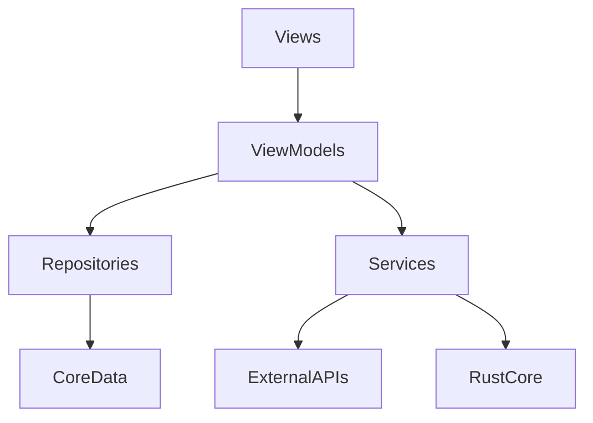

# OVEREND 開發全手冊 (Development Omnibus)

> **版本：** 1.0 (2026-01-21)  
> **狀態：** 專案進度 99%+ (Beta / 發布準備階段)  
> **核心使命：** 讓研究者專注於研究本質，而非工具操作。

---

## 📖 目錄

1. [專案基礎與工程規範](#1-專案基礎與工程規範)
2. [技術架構與核心服務](#2-技術架構與核心服務)
3. [核心功能設計](#3-核心功能設計)
4. [AI 智慧代理人 (Companion)](#4-ai-智慧代理人)
5. [UI/UX 設計與產品質感](#5-uiux-設計與產品質感)
6. [測試、品質與維護](#6-測試品質與維護)
7. [開發里程碑紀錄](#7-開發里程碑紀錄)

---

## 1. 專案基礎與工程規範

### 1.1 核心定義

OVEREND = 文字編輯器 (Word) + 文獻管理 (EndNote) + AI 輔助。  
這是專為華語研究者設計的原生 macOS/iPadOS 應用程式。

### 1.2 程式碼規範 (參考 [CODING_RULES.md](.claude/CODING_RULES.md))

- **架構模型**：嚴格遵守 MVVM 模式。
- **檔案命名**：
  - `Views/` 結尾為 `*View.swift`
  - `ViewModels/` 結尾為 `*ViewModel.swift`
  - `Services/` 結尾為 `*Service.swift`
- **代碼維護**：
  - 單一 View 檔案不超過 **300 行**。超過時需拆分為 `+Subviews.swift` 或 `+Methods.swift`。
  - 單一函數不超過 **50 行**。
  - 禁止 Force Unwrap，優先使用 `guard let`。

### 1.3 工程體系

- **語言**：Swift 6 (SwiftUI)
- **資料庫**：Core Data (專用 In-Memory 測試環境)
- **渲染引擎**：WebKit (Legacy) / Typst + Rust (Modern)

---

## 2. 技術架構與核心服務

### 2.1 分層依賴

### 2.2 核心服務層

- **UnifiedAIService**: 整合 Apple Intelligence，提供寫作建議、翻譯、規範檢查。
- **CitationService**: 支援 APA 7th, MLA 9th, BibTeX 等多種學術格式。
- **PDFService**: 高效提取 PDF 元數據，DOI 識別率達 95%+。
- **TypstService**: Rust 核心整合，提供精確的 PDF 渲染與學術排版。

---

## 3. 核心功能設計

### 3.1 文獻管理 (Library)

- **智慧匯入**：支援 PDF 拖放匯入、BibTeX 批次匯入。
- **元數據增強**：自動從 PDF 內容識別 DOI、標題與作者。
- **智能分類**：智慧資料夾與標籤系統。

### 3.2 專業寫作中心 (Writing Center)

- **A4 分頁預覽**：模擬真實列印效果。
- **@ 快速引用**：編輯器內輸入 `@` 即可即時搜尋並插入文獻。
- **學術翻譯**：右鍵選單直接進行中英學術詞彙互譯。

---

## Chapter 4: AI 智慧代理人 (Companion)

### 4.1 夥伴系統 (The Companion)

- **預設角色**：小研 (Yen)，翡翠綠貓頭鷹。
- **功能**：
  - 協助寫作優化與摘要。
  - 根據開發活動提供成長回饋 (Lv.1 -> Lv.50)。
  - 支援自定義角色生成。

---

## 5. UI/UX 設計與產品質感

### 5.1 翡翠設計語言 (Emerald Design)

- **主色調**：Spring Green (`#00D97E`)。
- **視覺風格**：WWDC25 Liquid Glass 風格，強調通透感與立體感。
- **深色模式**：專為學術研究設計的 Dark Slate Blue 配色，降低眼部疲勞。

### 5.2 微互動 (Micro-Interactions)

- 高強度陰影 (5 級陰影系統)。
- 懸停浮起效果 (1.02x 縮放)。
- 毛玻璃背景 (`.ultraThinMaterial`) 與漸層邊框。

---

## 6. 測試、品質與維護

### 6.1 測試矩陣

- **單元測試**：覆蓋核心解析器 (PDF, BibTeX) 與 AI 領域。
- **UI 測試**：自動化驗證文獻庫與編輯器的核心流程。
- **健全性檢查**：DOI 識別回退機制、Core Data 線程安全。

### 6.2 自動化流程

- 支援透過 `/end-of-day` 指令自動備份、更新日誌並同步至 Notion。

---

## 7. 開發里程碑紀錄

| 日期 | 重點事件 |
| --- | --- |
| 2025-12-28 | 繁體中文術語全面標準化 (翡翠綠主題確立) |
| 2025-12-31 | Apple Intelligence 整合完成 |
| 2026-01-03 | 統一 AI 服務架構 (Domains) 建立 |
| 2026-01-11 | Emerald UI 2.0 全面整合成型 |
| 2026-01-21 | 開發文檔大匯整 (DEVELOPMENT_OMNIBUS.md) |

---

> [!TIP]
> 詳盡文檔請參閱 [DOCS/INDEX.md](DOCS/INDEX.md) 獲取完整 130+ 份文件連結。
