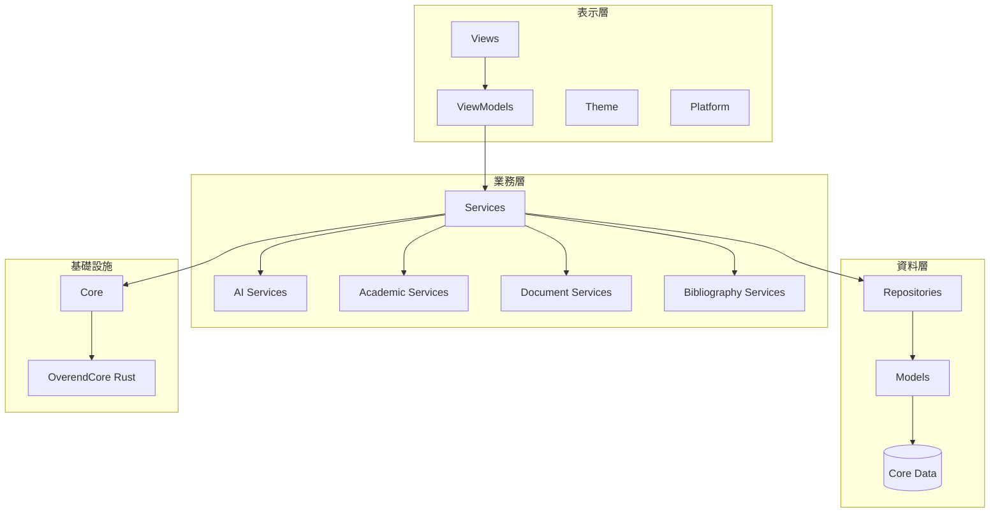

# OVEREND 專案結構說明

> 最後更新：2026-01-16

## 專案根目錄 `/OVEREND/`

```
OVEREND/
├── OVEREND/                    # 主要 Swift 原始碼
├── OVEREND.xcodeproj/          # Xcode 專案檔
├── OVERENDTests/               # 單元測試
├── OVERENDUITests/             # UI 測試
├── OverendCore/                # Rust 核心模組
├── OVEREND_WEB/                # 網頁版（行銷/文件）
├── DOCS/                       # 專案文件
├── TestData/                   # 測試資料
├── Testing/                    # 測試素材與腳本
├── Training/                   # AI 模型訓練資料
├── scripts/                    # 建置/部署腳本
├── build/                      # 建置輸出
└── _xcode_templates/           # Xcode 模板
```

---

## 主要原始碼 `/OVEREND/OVEREND/`

### 應用程式入口

| 資料夾/檔案 | 說明 |
|------------|------|
| `OVERENDApp.swift` | 應用程式入口點 |
| `App/` | App 生命週期相關 |
| `App/Intents/` | App Intents (Siri/Shortcuts 整合) |
| `Assets.xcassets/` | 圖片、App Icon 等資源 |
| `OVEREND.entitlements` | 應用程式權限設定 |

---

### 核心架構層

#### `/Core/` - 基礎設施核心

| 檔案 | 說明 |
|------|------|
| `AppError.swift` | 統一錯誤處理 |
| `AppLogger.swift` | 日誌系統 |
| `AppService.swift` | 服務生命週期管理 |
| `EventBus.swift` | 事件發布/訂閱系統 |
| `OverendCoreBridge.swift` | Swift ↔ Rust FFI 橋接 |
| `OverendCoreFFI.swift` | UniFFI 生成的綁定 |

#### `/Frameworks/` - 外部框架

| 資料夾 | 說明 |
|--------|------|
| `OverendCore.xcframework/` | Rust 編譯的跨平台 Framework |
| ├── `ios-arm64/` | iOS 真機版 |
| ├── `ios-arm64-simulator/` | iOS 模擬器版 |
| └── `macos-arm64/` | macOS 版 |

---

### 資料層

#### `/Models/` - 資料模型

| 資料夾 | 說明 |
|--------|------|
| `根目錄` | Core Data 模型、Entry、Library 等 |
| `Companion/` | AI 夥伴系統資料模型 |
| `PhysicalCanvas/` | 實體畫布/手寫筆記模型 |

#### `/Repositories/` - 資料存取層

| 用途 | 說明 |
|------|------|
| Repository Pattern | Entry、Library、Group 等的 CRUD 操作 |

---

### 服務層 `/Services/`

#### `/Services/Core/` - 核心服務

| 檔案 | 說明 |
|------|------|
| `ServiceContainer.swift` | 依賴注入容器 |
| `BatchOperationService.swift` | 批次操作服務 |

#### `/Services/AI/` - AI 服務

| 資料夾 | 說明 |
|--------|------|
| `Core/` | AI 服務核心 (UnifiedAIService, AdapterManager) |
| `Agent/` | AI Agent 系統 |
| `Domains/` | 領域專屬 AI (翻譯、寫作、標準化) |
| `Models/` | AI 模型定義 |
| `Providers/` | AI 提供者 (OpenAI, Gemini, Ollama) |
| `Tools/` | AI 工具 |
| `Utilities/` | AI 工具函式 |

#### `/Services/Academic/` - 學術服務

| 資料夾 | 說明 |
|--------|------|
| `Citation/` | 引用格式服務 (APA, MLA, Chicago) |
| `Language/` | 語言處理 (中文姓名格式化) |
| `Standards/` | 學術標準 (詞彙防火牆) |

#### `/Services/Bibliography/` - 書目服務

| 用途 | 說明 |
|------|------|
| BibTeX 解析 | 書目匯入匯出 |
| RIS 解析 | 多格式支援 |
| Zotero Bridge | Zotero 整合 |

#### `/Services/Document/` - 文件服務

| 資料夾 | 說明 |
|--------|------|
| `Export/` | 文件匯出 (DOCX, PDF) |
| `Format/` | 格式處理 |
| `Metadata/` | 元資料擷取 |
| `OCR/` | 光學字元辨識 |

#### `/Services/External/` - 外部整合

| 用途 | 說明 |
|------|------|
| CrossRef | 線上書目搜尋 |
| Notion 同步 | 筆記同步 |

#### `/Services/Companion/` - AI 夥伴服務

| 用途 | 說明 |
|------|------|
| CompanionService | 虛擬助手邏輯 |

#### `/Services/Agents/` - Agent 服務

| 用途 | 說明 |
|------|------|
| LiteratureAgent | 自動化文獻處理 |

#### `/Services/Productivity/` - 生產力服務

| 用途 | 說明 |
|------|------|
| Pomodoro | 番茄鐘 |
| Daily Goals | 每日目標 |

#### `/Services/Shared/` - 共用服務

| 用途 | 說明 |
|------|------|
| ToastManager | 通知訊息 |
| ClipboardService | 剪貼簿 |

#### `/Services/Utilities/` - 工具服務

| 用途 | 說明 |
|------|------|
| FileService | 檔案操作 |
| NetworkService | 網路請求 |

---

### 表示層

#### `/ViewModels/` - 視圖模型

| 用途 | 說明 |
|------|------|
| MVVM Pattern | 分離 UI 邏輯與業務邏輯 |

#### `/Views/` - 視圖

| 資料夾 | 說明 |
|--------|------|
| `AICenter/` | AI 功能中心 |
| `AICommand/` | AI 命令列介面 |
| `AICompanion/` | AI 夥伴 UI |
| `Common/` | 通用視圖 |
| `Components/` | 可重用元件 |
| ├── `Buttons/` | 按鈕元件 |
| ├── `Cards/` | 卡片元件 |
| ├── `Feedback/` | 反饋元件 (Toast, Loading) |
| ├── `Inputs/` | 輸入元件 |
| └── `Sheets/` | 彈出視窗 |
| `Editor/` | 文字編輯器 |
| `Emerald/` | Emerald 風格書目管理介面 |
| `EntryDetail/` | 書目詳情頁 |
| `EntryList/` | 書目列表 |
| `ExtractionWorkbench/` | PDF 萃取工作檯 |
| `Metadata/` | 元資料編輯 |
| `OnlineSearch/` | 線上搜尋 |
| `Settings/` | 設定頁面 |
| └── `Sections/` | 設定區塊 |
| `Sidebar/` | 側邊欄 |
| `Utils/` | 視圖工具 |

#### `/Theme/` - 主題

| 用途 | 說明 |
|------|------|
| AppTheme | 顏色、字體、間距定義 |
| Dark/Light Mode | 深色/淺色模式 |

---

### 平台適配 `/Platform/`

| 資料夾 | 說明 |
|--------|------|
| `Shared/` | 跨平台共用程式碼 |
| `macOS/` | macOS 專屬功能 |
| `iPad/` | iPad 專屬視圖 |

---

### 其他

| 資料夾 | 說明 |
|--------|------|
| `/Utilities/` | 通用工具函式 |
| `/Tests/` | 內嵌測試 |

---

## 輔助目錄

| 目錄 | 說明 |
|------|------|
| `/OverendCore/` | Rust 核心模組原始碼 (Typst, Hayagriva) |
| `/DOCS/` | 專案文件、設計文件、API 文件 |
| `/TestData/` | 測試用 PDF、BibTeX 檔案 |
| `/Testing/` | 測試素材 (文稿範本、測試腳本) |
| `/Training/` | AI 模型微調資料 (LoRA adapters) |
| `/scripts/` | 建置腳本 (DMG 打包、圖示生成) |
| `/OVEREND_WEB/` | 官網/行銷網站 |

---

## 架構圖



---

## 命名慣例

| 層級 | 命名規則 | 範例 |
|------|---------|------|
| Views | `*View.swift` | `EmeraldLibraryView.swift` |
| ViewModels | `*ViewModel.swift` | `LibraryViewModel.swift` |
| Services | `*Service.swift` | `CitationService.swift` |
| Repositories | `*Repository.swift` | `EntryRepository.swift` |
| Models | 名詞 | `Entry.swift`, `Library.swift` |
| Extensions | `Type+Feature.swift` | `String+Extensions.swift` |
